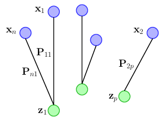
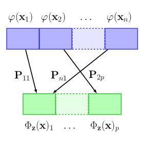

# Optimal Transport Kernel Embedding

The repository implements the Optimal Transport Kernel Embedding (OTKE) described in the following paper

>Grégoire Mialon*, Dexiong Chen*, Alexandre d'Aspremont, Julien Mairal.
[A Trainable Optimal Transport Embedding for Feature Aggregation and its Relationship to Attention][1]. ICLR 2021.
<br/>*Equal contribution

TLDR; the paper demonstrates the advantage of our OTK Embedding over usual aggregation methods (e.g, mean pooling, max pooling or attention) when faced with data composed of large sets of features, such as biological sequences, natural language sentences or even images. Our embedding can be learned either with or without labels, which is especially useful when few annotated data are available, and used alone as a kernel method or as a layer in larger models.

## A short description about the module

The principal module is implemented in `otk/layers.py` as `OTKernel`. It is generally used with a non-linear layer. Combined with the non-linear layer, it takes a sequence or image tensor as input, and performs a non-linear embedding and an adaptive pooling (attention + pooling) based on optimal transport. Specifically, given a sequence x as input, it first computes the optimal transport plan from x to some reference z (left figure). The optimal transport plan, interpreted as the attention score, is then used to obtain a new sequence of the same size as z following a non-linear mapping (right figure). See more details in our [paper][1].




OTKernel can be trained in either **unsupervised** (with K-means) or **supervised** (like the multi-head self-attention module in Transformer) fashions. It can be used as a module in neural networks, or alone as a kernel method.

#### Using OTKernel as a module in NNs

Here is an example to use `OTKernel` in a one-layer model
```python
import torch
from torch import nn
from otk.layers import OTKernel

in_dim = 128
hidden_size = 64
# create an OTK model with single reference and 10 supports
otk_layer = nn.Sequential(
    nn.Linear(in_dim, hidden_size),
    nn.ReLU(),
    OTKernel(in_dim=hidden_size, out_size=10, heads=1)
)
# create 2 batches of sequences of L=100 and dim=128
input = torch.rand(2, 100, in_dim)
# each output sequence has L=10 and dim=64
output = otk_layer(input) # 2 x 10 x 64
```

#### Using OTKernel alone as a kernel mapping

When using OTKernel alone, the non-linear mapping is a Gaussian kernel (or a [convolutional kernel][5]). The full model for sequence is implemented in `otk/models.py` as `SeqAttention`. Here is an example
```python
import torch
from otk.models import SeqAttention

in_dim = 128
hidden_size = 64
nclass = 10
# create a classification model based on one CKN and OTK, with filter_size=1 and sigma=0.6 for CKN and with 4 references and 10 supports for OTK
otk_model = SeqAttention(
    in_dim, nclass, [hidden_size], [1], [1], [0.6], out_size=10, heads=4
)
# create 2 batches of sequences of L=100 and dim=128
input = torch.rand(2, in_dim, 100)
# output: 2 x 10
output = otk_model(input)
```
Besides training with back-propagation, the above `otk_model` can be trained without supervision when provided with a `data_loader` object created by `torch.utils.data.DataLoader`.
```python
from torch.utils.data import DataLoader

# suppose that we have stored data in dataset
data_loader = DataLoader(dataset, batch_size=256, shuffle=False)
otk_model.unsup_train(data_loader)
```

## Installation

We strongly recommend users to use [miniconda][2] to install the following packages (link to [pytorch][3])
```
python=3.6
numpy
scikit-learn
pytorch=1.4.0
pandas
```
Then run
```bash
export PYTHONPATH=$PWD:$PYTHONPATH
```

## Experiments

We provide here the commands to reproduce a part of the results in our paper.

#### Reproducing results for SCOP 1.75

To reproduce the results in Table 2, run the following commands.

* **Data preparation**
    ```bash
    cd data
    bash get_scop.sh
    ```

* **Unsupervised learning with OTK for SCOP 1.75**
    ```bash
    cd experiments
    python scop175_unsup.py --n-filters 512 --out-size 100 --eps 0.5
    ```

* **Supervised learning with OTK for SCOP 1.75**
    ```bash
    cd experiments
    # OTK with one reference
    python scop175_sup.py --n-filters 512 --heads 1 --out-size 50 --alternating
    # OTK with multiple references
    python scop175_sup.py --n-filters 512 --heads 5 --out-size 10 --alternating
    ```

#### Reproducing results for DeepSEA

To reproduce the results (auROC=0.936, auPRC=0.360) in Table 3, run the following commands.

* **Data preparation**
    ```bash
    cd data
    bash get_deepsea.sh
    ```

* **Evaluating our pretrained model**

    Download our [pretrained model][4] to `./logs_deepsea` and then run
    ```bash
    cd experiments
    python eval_deepsea.py --eps 1.0 --heads 1 --out-size 64 --hidden-layer --position-encoding gaussian --weight-decay 1e-06 --position-sigma 0.1 --outdir ../logs_deepsea --max-iter 30 --filter-size 16 --hidden-size 1536
    ```

* **Training and Evaluating a new model**

    First train a model with the following commands
    ```bash
    cd experiments
    python train_deepsea.py --eps 1.0 --heads 1 --out-size 64 --hidden-layer --position-encoding gaussian --weight-decay 1e-06 --position-sigma 0.1 --outdir ../logs_deepsea --max-iter 30 --filter-size 16 --hidden-size 1536
    ```
    Once the model is trained, run
    ```bash
    python eval_deepsea.py --eps 1.0 --heads 1 --out-size 64 --hidden-layer --position-encoding gaussian --weight-decay 1e-06 --position-sigma 0.1 --outdir ../logs_deepsea --max-iter 30 --filter-size 16 --hidden-size 1536
    ```

#### Reproducing results for SST-2

To reproduce the results in Table 4, run the following commands.

* **Data preparation**
    ```bash
    cd data
    bash get_sst2.sh
    ```

* **Unsupervised learning with OTK for SST-2**
    ```bash
    cd experiments
    python nlp_unsup.py --n-filters 2048  --out-size 3
    ```

* **Supervised learning with OTK for SST-2**
    ```bash
    cd experiments
    # OTK with one reference
    python nlp_sup.py --n-filters 64 --out-size 3 --eps 3.0 --alternating
    ```


[1]: https://arxiv.org/abs/2006.12065
[2]: https://docs.conda.io/en/latest/miniconda.html
[3]: https://pytorch.org
[4]: http://pascal.inrialpes.fr/data2/dchen/pretrained/otk_checkpoint.zip
[5]: https://doi.org/10.1101/217257
